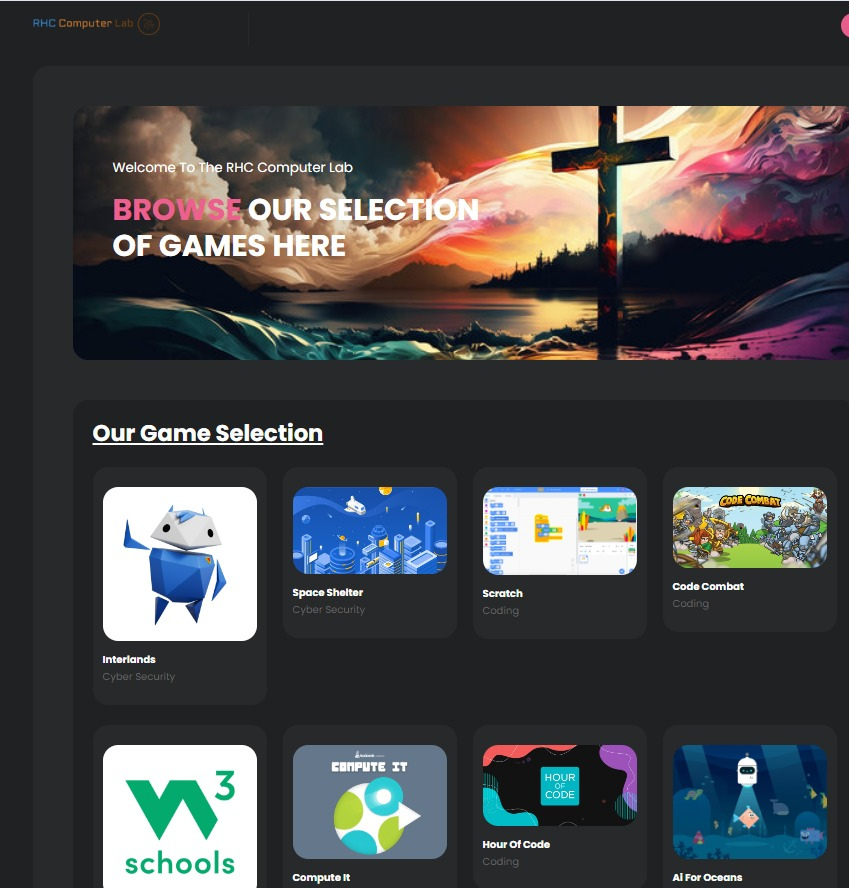

# Computer Lab Work Project

### All company information has been redacted as this is intended to serve as a sample of professional projects I completed at this company.

## Overview of Project

This project involved setting up and configuring a 12-system computer lab tailored for educational use, complete with a switched network, administrative controls, and custom educational content.

### Project Components

- **12-System Computer Lab:**
  - A fully configured computer lab with 12 networked systems designed for educational activities.
  
- **Switched Network:**
  - Implemented a switched network to ensure reliable and secure communication between systems.

- **Administration Computer:**
  - Configured an administration computer to manage and oversee the entire lab's operations.

- **Projector Setup:**
  - Integrated a projector for interactive lessons and presentations, enhancing the learning experience.

- **Custom Landing Page:**
  - Developed a custom landing page that hosts educational games and content, ensuring all resources are appropriate and educational.
  - Includes links to FAQs, lab rules, and other important information for users.

- **Custom Educational Content:**
  - Created and curated educational content tailored for the lab's users, focusing on enhancing digital literacy and computer skills.

- **FAQ and Rules Section:**
  - Designed an easy-to-navigate FAQ and rules section to guide users on proper lab usage and to address common questions.

- **Custom Wallpapers:**
  - Designed and deployed custom wallpapers across all systems to create a consistent and branded environment.

- **Administrative Controls:**
  - Locked down access to critical system functions such as Windows Defender, Control Panel, and other administrative tools to prevent unauthorized changes.
  - Implemented policies to restrict user access to sensitive settings, ensuring systems remain secure and operational.

- **Lesson Plan Integration:**
  - Developed a series of lesson plans covering basic computer skills, internet safety, digital citizenship, coding, and cybersecurity.
  - Each lesson plan includes hands-on activities, quizzes, and interactive games.

- **Reboot and Restore System:**
  - Installed and configured a Reboot Restore system to reset systems to a predefined state upon reboot, ensuring a consistent environment for each user.

- **Windows Admin Panel Configuration:**
  - Configured the Windows Admin Panel to manage users, policies, and security settings across the lab.

- **NAS on a USB:**
  - Set up a Network-Attached Storage (NAS) on a USB device for centralized file storage and easy access to educational materials and project files.

## Summary

This project showcases a comprehensive approach to setting up and managing a computer lab for educational purposes. It involved not only the technical configuration of hardware and software but also the development of custom content and administrative controls to create a secure, engaging, and educational environment for users.

